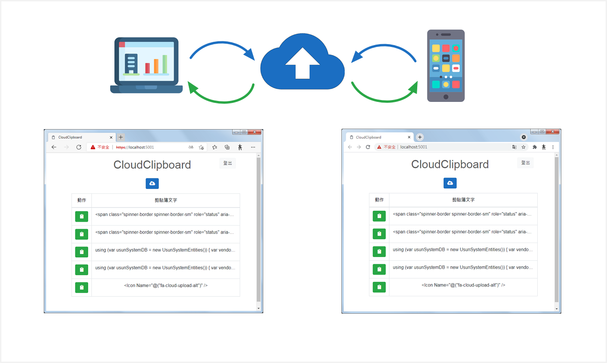

# CloudClipboard

*雲端剪貼簿(CloudClipboard)提供跨裝置共享剪貼簿文字內容功能。
*

## 使用方法

1. 複製要共享的文字。
2. 在來源端瀏覽器打開雲端剪貼簿首頁後，再點擊**新增到雲端剪貼簿**()按鈕。
3. 在目的端瀏覽器打開雲端剪貼簿首頁後，再點擊**複製到本地剪貼簿**()按鈕。
4. 共享文字已複製到目的端裝置的剪貼簿，可使用Ctrl+V或右鍵選單方式貼上。

* 當瀏覽器詢問**要求下列權限：讀取已複製到剪貼簿的文字和圖片**對話框時，請點擊**允許**按鈕。

## 感謝

- 
Icons made by <a href="https://www.freepik.com" title="Freepik">Freepik</a> from <a href="https://www.flaticon.com/" title="Flaticon">www.flaticon.com</a>

- <a href="https://iconscout.com/icons/paste-clipboard" target="_blank">Paste Clipboard Line Icon</a> by <a href="https://iconscout.com/contributors/serpenttina" target="_blank">Nagarjan S</a>
